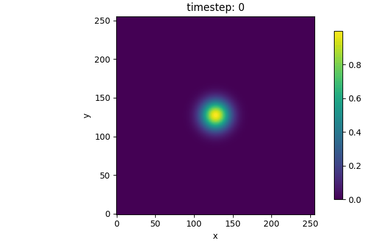

# Climate-Sim-MPI-CPP
[](../../actions/workflows/ci.yml)
[](../../actions/workflows/codeql.yml)
[](https://github.com/antoniorizzoeng/climate-sim-mpi-cpp/actions/workflows/format.yml)
[](https://github.com/antoniorizzoeng/climate-sim-mpi-cpp/actions/workflows/docs.yml)

High-performance 2D climate field simulation with MPI (C++), including Python-based visualization tools.



## Features

### Simulation (C++/MPI)
- Parallel domain decomposition (2D Cartesian).
- Diffusion and advection steps with configurable parameters.
- Boundary conditions:
  - Periodic
  - Dirichlet
  - Neumann
- Initial conditions:
  - Constant zero
  - Gaussian hotspot
  - Binary / NetCDF input
- Output formats:
  - CSV (default, portable)
  - NetCDF (with attributes, compression, chunking planned)
- Configurable via YAML and CLI overrides.
- Timing statistics logged at end of run.

### Visualization (Python)
- Reassemble distributed per-rank snapshots into global arrays.
- Supported formats: CSV and NetCDF.
- Plot utilities:
  - Single field plots with colorbars.
  - Field comparison with optional difference panel.
  - Animation of time steps (MP4 / GIF).
- Watch mode:
  - Incrementally rebuild canvas while simulation is running.
  - Options for refresh rate, starting from latest N frames.
- CLI entrypoint for manual visualization tasks.

---

## Requirements

### C++ (simulation)
- C++17 compiler
- CMake ≥ 3.16
- MPI implementation (OpenMPI, MPICH, etc.)
- Optional: NetCDF-C library

### Python (visualization)
Install dependencies with:

```bash
pip install -r requirements.txt
```

Key packages:
- numpy
- matplotlib
- netCDF4 (optional, for NetCDF outputs)
- pytest (for testing)

---

## Build & Run (Simulation)

```bash
mkdir build && cd build
cmake ..
make -j
```

Run simulation (example, 4 MPI ranks):

```bash
mpirun --oversubscribe -np 4 ./src/climate_sim --config=configs/dev.yaml --output.format=netcdf
```

Example `configs/dev.yaml`:

```yaml
grid:    { nx: 256, ny: 256, dx: 1.0, dy: 1.0 }
physics: { D: 0.05, vx: 0.5, vy: 0.0 }
time:    { dt: 0.1, steps: 1000, out_every: 100 }
bc:      periodic
output:  { prefix: "dev" }

ic:
  preset: gaussian_hotspot
  file:   "inputs/ic_global_double.bin"
  params:
    A: 1.0
    sigma_frac: 0.05
    xc_frac: 0.5
    yc_frac: 0.5
```

---

## Visualization Usage

### CLI

```bash
# Rebuild and save single frame
python -m visualization.cli show --dir outputs --step 10 --fmt csv --save frame.png

# Animate all steps into a GIF
python -m visualization.cli animate --dir outputs --fmt csv --save anim.gif --writer pillow

# Watch live simulation outputs
python -m visualization.cli watch --dir outputs --fmt csv --interval 1.0

# Interactive simulation viz
python -m visualization.cli interactive --dir outputs --fmt csv
```

### Python API

```python
from visualization.io import load_global
from visualization.plots import animate_from_outputs

U = load_global("outputs", step=0, fmt="csv")
anim, fig, ax = animate_from_outputs("outputs", fmt="csv", save="movie.gif")
```

---

## Tests

### C++ tests (gtest)
Run via CTest:

```bash
cd build
ctest --output-on-failure
```

### Python tests (pytest)
Run visualization tests:

```bash
pytest tests/visualization -v
```

---

## License

This project is licensed under the **GNU Affero General Public License v3.0 (AGPLv3)**.
- Strong copyleft: any derivative or network service use must publish source under AGPL.
- Compatible with most GPL code.
- Discourages proprietary/commercial adoption.

See [LICENSE](LICENSE) for full text.
