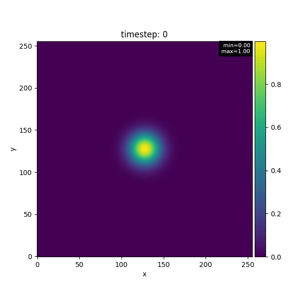

# Climate-Sim-MPI-CPP
[](../../actions/workflows/ci.yml)
[](../../actions/workflows/codeql.yml)
[](https://github.com/antoniorizzoeng/climate-sim-mpi-cpp/actions/workflows/format.yml)
[](https://github.com/antoniorizzoeng/climate-sim-mpi-cpp/actions/workflows/docs.yml)

High-performance 2D climate field simulation with MPI (C++), including Python-based visualization tools.

<p align="center">
  
  
</p>

## Features

### Simulation (C++/MPI)
- Parallel domain decomposition (2D Cartesian).
- Diffusion and advection steps with configurable parameters.
- Boundary conditions:
  - Periodic
  - Dirichlet
  - Neumann
- Initial conditions:
  - Constant zero
  - Gaussian hotspot
  - NetCDF input
- Output format: NetCDF
- Configurable via YAML and CLI overrides.
- Timing statistics logged at end of run.

### Visualization (Python)
- Reassemble distributed per-rank snapshots into global arrays.
- Supported format: NetCDF.
- Plot utilities:
  - Single field plots with colorbars.
  - Field comparison with optional difference panel.
  - Animation of time steps (MP4 / GIF).
- Watch mode:
  - Incrementally rebuild canvas while simulation is running.
  - Options for refresh rate, starting from latest N frames.
- CLI entrypoint for manual visualization tasks.

---

## Requirements

### C++ (simulation)
- C++17 compiler
- CMake ≥ 3.16
- MPI implementation (OpenMPI, MPICH, etc.)
- NetCDF-C library

## Build & Run

```bash
mkdir build && cd build
cmake ..
make -j
```

Run simulation (example, 4 MPI ranks):

```bash
mpirun --oversubscribe -np 4 ./src/climate_sim --config=configs/dev.yaml
```

### Python (visualization)
Install dependencies with:

```bash
pip install -r requirements.txt
```

---

## Visualization Usage

### CLI

```bash
# Rebuild and save single frame
python -m visualization.cli show --dir outputs --step 10 --save frame.png

# Animate all steps into a GIF
python -m visualization.cli animate --dir outputs --save anim.gif --writer pillow

# Watch live simulation outputs
python -m visualization.cli watch --dir outputs --interval 1.0

# Interactive simulation viz
python -m visualization.cli interactive --dir outputs
```
---

## Tests

### C++ tests (gtest)
Run via CTest:

```bash
cd build
ctest --output-on-failure
```

### Python tests (pytest)
Run visualization tests:

```bash
pytest tests/visualization -v
```

---

## Installation

After building with CMake, you can install `climate_sim` system-wide:

```bash
cmake --install build --prefix /usr/local
```

This installs:

- `climate_sim` into `/usr/local/bin`
- CMake package config files into `/usr/local/lib/cmake/climate-sim-mpi-cpp`
- Headers and libraries for bundled dependencies (e.g. GoogleTest, if enabled)

> **Note:** `sudo` may be required if you do not have write permission for the prefix.

### Local Installation (Non-Root)

To install into a custom location (e.g. `$HOME/.local`):

```bash
cmake --install build --prefix $HOME/.local
```

Make sure the binary directory is on your `PATH`:

```bash
export PATH="$HOME/.local/bin:$PATH"
```

Now you can run the simulator from anywhere:

```bash
climate_sim --config configs/dev.yaml
```

---

## Uninstallation

CMake does not generate an uninstall target by default. You can remove the installed files manually.

If you installed to `/usr/local`:

```bash
sudo rm -f /usr/local/bin/climate_sim
sudo rm -rf /usr/local/lib/cmake/climate-sim-mpi-cpp
```

If you installed locally to `$HOME/.local`:

```bash
rm -f $HOME/.local/bin/climate_sim
rm -rf $HOME/.local/lib/cmake/climate-sim-mpi-cpp
```

Alternatively, consider using package managers (e.g. building a `.deb` or `.rpm`) for more automated installation/uninstallation.

---

## Verification

After installation, verify the binary is available:

```bash
which climate_sim
```

## License

This project is licensed under the **GNU Affero General Public License v3.0 (AGPLv3)**.
- Strong copyleft: any derivative or network service use must publish source under AGPL.
- Compatible with most GPL code.
- Discourages proprietary/commercial adoption.

See [LICENSE](LICENSE) for full text.
Visit https://antoniorizzoeng.github.io/climate-sim-mpi-cpp/ for more info.
