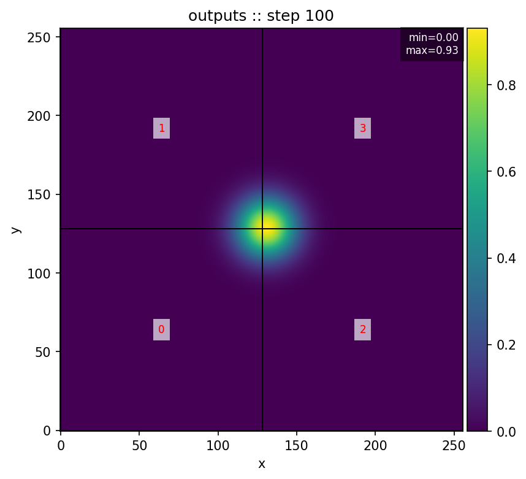

# Demo & Gallery

Below is a short animation from a 2D Gaussian hotspot diffusing and advecting to the right.
The simulation was run on 4 MPI ranks with periodic BCs and saved every 10 steps.


**Reproduce**: see [Getting Started](getting_started.md) for the exact `dev.yaml` and commands.

---
## Add overlays


**Reproduce**  Same simulation run as [Getting Started](getting_started.md) then ``` python -m visualization.cli show   --dir outputs   --step 100   --overlay-rankbox   --overlay-minmax   --overlay-rankgrid ```


[← Back to Home](index.md)
